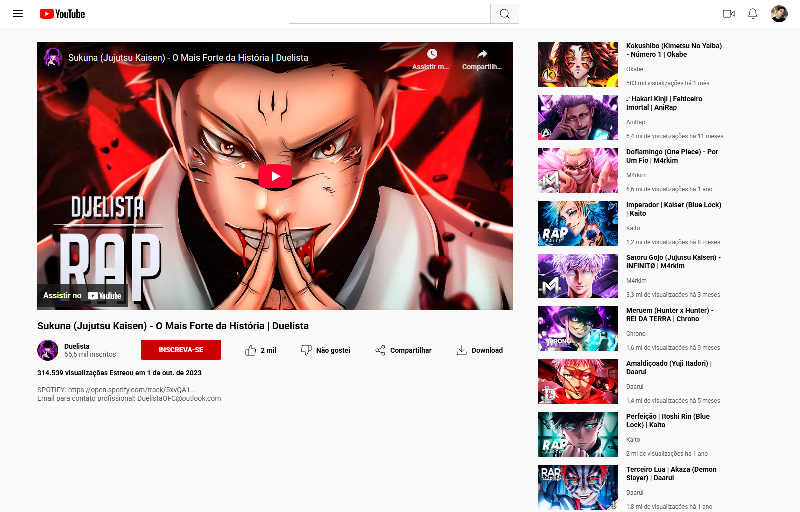

# 📺 Projeto CSS - Recriação da Página de Vídeo do YouTube

## 🧩 Sobre o Projeto

Este projeto foi desenvolvido como parte da formação de CSS da [Dio.me](https://www.dio.me/). O objetivo principal foi treinar o uso de **Flexbox** na construção de um layout inspirado na tela de reprodução de vídeos do YouTube.

Toda a estrutura HTML e o CSS foram escritos do zero. Algumas imagens, como a logo do YouTube e os ícones, foram retiradas do Figma disponibilizado pela professora.

## 🎨 Tema do Conteúdo

Para compor a seção de vídeos recomendados (miniaturas laterais), foram utilizados **vídeos, canais e thumbnails reais**, com temática voltada para **rap geek/anime**. A escolha desse tema teve como objetivo deixar o projeto mais visualmente atrativo e coerente com um nicho popular na plataforma.

> 🔹 Este é um projeto de cunho educacional e sem fins lucrativos. Todos os conteúdos utilizados pertencem aos seus respectivos criadores.

## 💻 Tecnologias Utilizadas

- HTML5  
- CSS3  
  - Flexbox  
  - Importação de fontes via Google Fonts  
- Organização de pastas por responsabilidade (HTML, CSS, imagens)

## 📸 Prévia

  
> *Imagem ilustrativa da tela de reprodução de vídeo, com área principal e sugestões laterais*

## 🚀 Funcionalidades

- Layout inspirado na interface do YouTube  
- Player de vídeo embutido (embed do YouTube)  
- Miniaturas reais na barra lateral  
- Barra de navegação superior com ícones  
- Botões de ação estilizados com Flexbox

## 🔗 Link para visualização

[🔗 Clique aqui para ver o projeto publicado](https://luis-fellipe.github.io/youtube-css-flexbox/)

## 📄 Licença

Projeto desenvolvido com fins educacionais. Os vídeos, thumbnails e nomes utilizados são de criadores reais e permanecem sob os direitos de seus respectivos donos. Caso haja qualquer solicitação de remoção, o conteúdo será prontamente ajustado.
